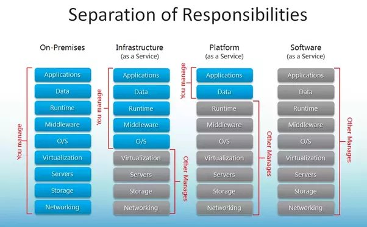

# Day 1

## On Premise Server
- Servers owned by your organization
- also referred as On-Prem servers

## Data Center
- a physical facility that organizations uses to host their critcal applications and data
- key components of a data center design include routers, switches, firewalls, storage systems, servers
  
## Public Cloud
- AWS, GCP, Azure, Digital Ocean, etc
- Servers that you can rent from Amazon, Google, Microsoft online

## What is Static IP?
- it won't change even if the machine is rebooted
- it could be private/public

## What is Dynamic IP?
- it will change everytime the machine is rebooted
- it could be private/public

## What is Private IP?
- the IP Address is accessible only within that machine/same network

## What is Public IP?
- the IP address is accessible from Internet
- this could be static/dynamic
  
## Linux Distributions
- Ubuntu
- Fedora
- CentOS
- Red Hat Enterprise Linux (RHEL)
- Kali

## What is a Package Manager?
Examples
- apt/apt-get, yum, rpm, dnf, nuget, chocolatey
- it is software utility that is used to install/uninstall/update/upgrade softwares
- every Linux Distributions supports one or two types of package managers
- For example
  - Ubuntu - apt/apt-get is the package manager
  - CentOS - yum or rpm or dnf
  - RHEL - yum or rpm or dnf
  - Kali - apt

## What is Hypervisor?
- is a software that helps you run multiple OS on the same laptop/desktop/workstation/server
- multiple OS can be actively running side by side
- it is a combination of hardware + software technology
- AMD Processors Virtualization feature - AMD-V
- Intel Processors Virtualization feature - VT-X
- two types
  - Type 1 - used in servers/workstations ( doesn't require a Host OS )
  - Type 2 - used in laptops/desktops/workstations ( requires a Host OS - can be Windows/Mac/Linux )

## What is VPC?
- Virtual Private Cloud
- it is a big network usually that could support 65536 IP addresses
  
## What is a subnet?
- logical network, VPC is divided into many logical networks called Subnet
- Subnets allows System administrators to apply different security policies for different Subnets
- there could be a Subnet for accounts departmnet, HR dept, COO office(CEO, CTO & CFO), Software, IT, etc with different permissions and network policies
- it is a range of IP address
- in other words IP block
- small network
- IPV4 or IPV6
- 192.168.49.0/24
- 24 (CIDR)

- 192.168.0.0/16 - how many IPs are there?
- a.b.c.d ( 32 bits - 4 bytes )
- a(8 bits - Octet)
- b(8 bits - Octet)
- c(8 bits - Octet)
- d(8 bits - Octet)

192.168.49.0
192.168.49.1
...
192.168.49.255

192.168.49.108
192.168.49.105

## What is Key pair?
- for an unix/linux user, instead of typing password to login an unix/linux/mac machine, we could create a key pair
- key pair contains a private key and a public key
- the private key will be kept on the same machine where it was created, usually in the home directory /home/jegan/.ssh/id_rsa
- the public key will be distributed to the trusted machines usually these keys are appended to a file called authorized_keys in the trusted machine /home/some-user/.ssh/authorized_keys
- when you login from your machine to a remote machine that has your public key, the remote machine gives the public key of yours which will be validated against the private key stored in your home directory, if it matches you will be allowed to login the remote machine without password
- this is an alternate way to login to unix/linux/mac machines without typing password
- this is considered more security compared to typing password 

## Info - Services offered by Public Cloud Vendors
- renting just the hardware - which is called Infrastructure as a Service ( IaaS)
- renting hardware + OS - which is called Platform as a Service ( PaaS )
- renting hardware + OS + Software - which is referred as Software as a Service ( SaaS)


## Info - What is an ec2 instance?
- it is a virtual machine we create in the public AWS cloud
- virtual machines could be created on our laptops/desktops/workstation/on-prem servers
- virtual machines could also be created on AWS/Azure/GCP/Digital Ocean public cloud portals
- is an Infrastructure as a Service (IaaS)
- in this model, Amazon takes care of networking, storage, servers and managing virtualization
- We need to take care of Operating System, application and data

## Lab - Login to AWS Web Console with your login credentials shared to you ( You need to perform all the lab exercies in the lab machine browser not on your office laptop web browser )

Once you login, your AWS web console would look like this


## Lab - Creating an ec2 instance with Ubuntu 22.04 Linux


Click on the Launch instances that show up in the top right corner (orange color)


Under the name and tags, type yourname-ubuntu-ec2


Under the Application and OS Images, select Ubuntu


Under the Instance type, select t2-micro


Under key-pair, select 'create new key pair' to generate new key-pair and download the same onto your lab machine.


Under Network settings, select existing security group, in my case I chose launch-wizard-1


Under Configure storage, accept the default size


Click on launch instance at the bottom right corner ( orange color button )


Click on the ec2 instance link that appears in green color


## Connecting to the ec2 instance from your lab machine using ssh
Now select the check box that appears on the left side of your ec2 instance that is running


Click on "connect" button that appears in the top


Copy the command that show near Example


```
cd ~/Downloads
chmod 400 ./jegan-new.pem
ssh -i "jegan-new.pem" ubuntu@ec2-54-245-204-120.us-west-2.compute.amazonaws.com
```

Expected output


Find the hostname and ip address of your ec2 instance


You need to install net-tools before you could run ifconfig command
```
sudo apt install -y net-tools
```


Now try to find the ip address
```
ifconfig
```


You may exit the ssh connection
```
exit
```


Terminate the ec2 instance


## Lab - Creating an application Load Balancer

We need to create 2 ec2 instances with Ubuntu 22.04 OS

Once the ec2 instances starts running, connect to the ec2 instance
```
ssh -i "jegan-new.pem" ubuntu@ec2-54-245-204-120.us-west-2.compute.amazonaws.com
```


From the ec2 instance, install nginx web server
```
sudo apt update
sudo apt install -y nginx
```

Repeat this in the second ec2 instance as well
```
ssh -i "jegan-new.pem" ubuntu@ec2-34-218-232-228.us-west-2.compute.amazonaws.com
sudo apt update
sudo apt install -y nginx
```

